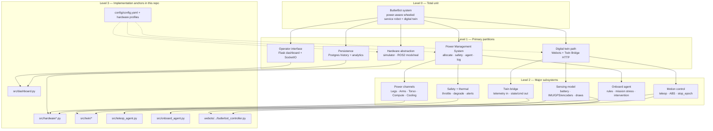
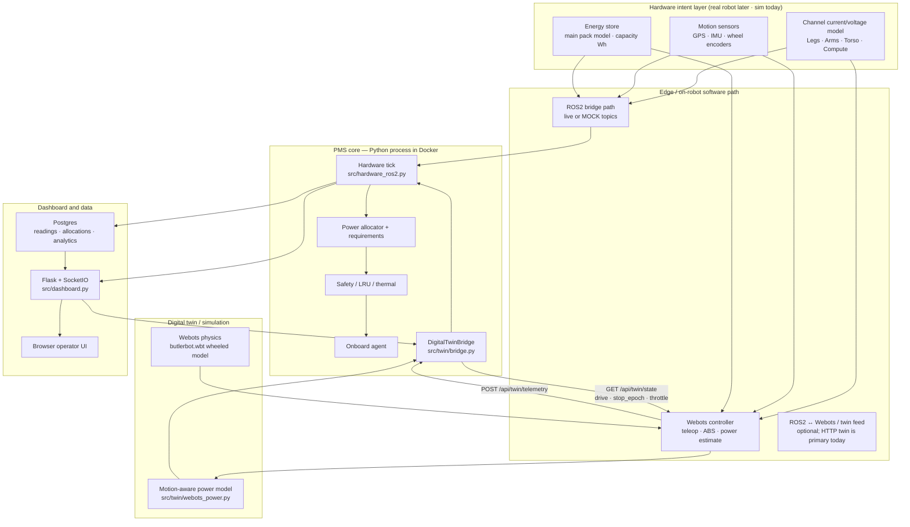
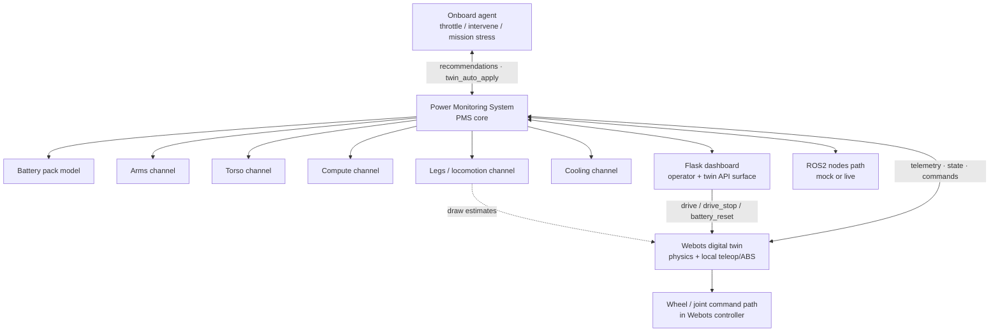
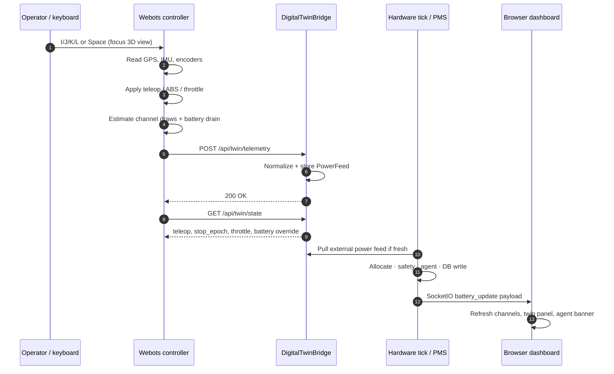
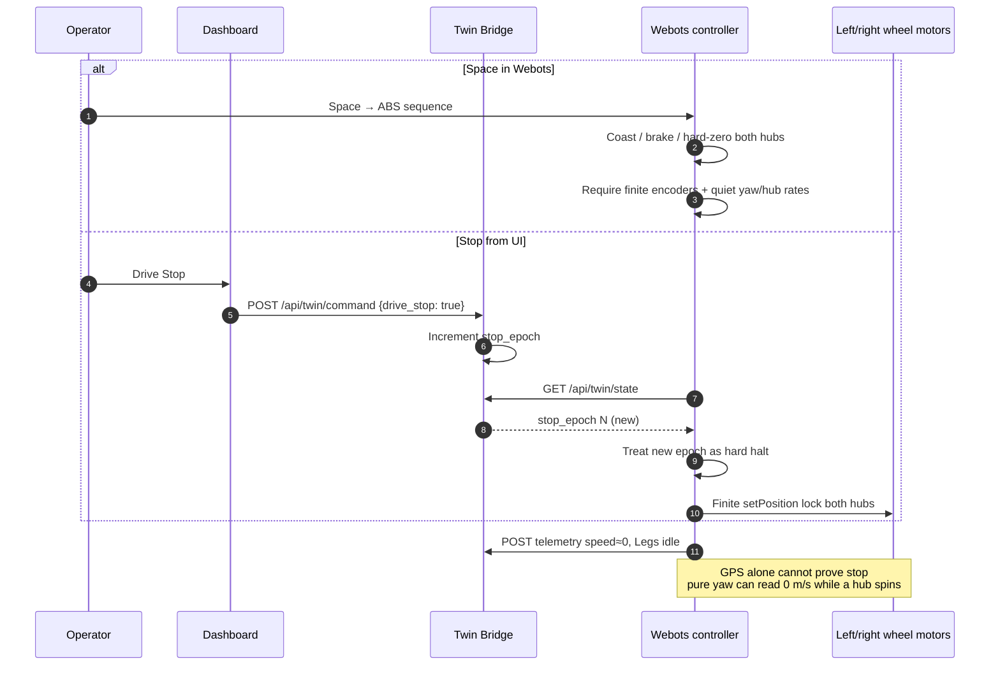
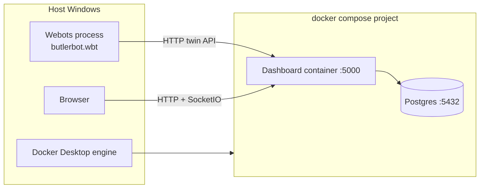

# Architecture diagrams — Robot Battery Monitor / ButlerBot

High-level maps for **first-time professional visitors** (and future maintainers).  
These diagrams describe **what the repo actually does today**, not every long-term north-star idea.

| Diagram | Type | Best question it answers |
|---------|------|---------------------------|
| [1. Pyramid hierarchy](#1-pyramid-hierarchy--how-the-unit-breaks-down) | Hierarchy / decomposition | “What are the major pieces of the robot system?” |
| [2. Layered stack](#2-layered-stack--where-software-sits) | Layered architecture | “How do sensors, twin, PMS, and UI stack?” |
| [3. PMS hub interactions](#3-pms-hub-interactions--who-talks-to-whom) | Systems interaction | “Where does power data and command authority live?” |
| [4. Live twin tick](#4-live-twin-tick-sequence) | Sequence | “What happens every simulation step when Webots is live?” |
| [5. Stop handshake](#5-stop-handshake-sequence) | Sequence | “How does ABS / dashboard Stop actually halt the robot?” |
| [6. Deployed processes](#6-deployed-processes-swimlanes) | Swimlanes | “What runs on my machine when I boot the demo?” |

Related deep dives:

- **AI / cold review fence (start here if you will edit):** [`REVIEW_CHECKLIST.md`](REVIEW_CHECKLIST.md)
- Twin power contract: [`TWIN_POWER_BRIDGE.md`](TWIN_POWER_BRIDGE.md)
- Residual spin / stop reliability: [`STABILITY.md`](STABILITY.md)
- Wheeled energy baseline: [`V1_WHEELED_ENERGY_BASELINE.md`](V1_WHEELED_ENERGY_BASELINE.md)
- Code entry points: root [`README.md`](../README.md) “Code tour”

---

## How to read these (student / visitor cheat sheet)

| Name | What it emphasizes |
|------|--------------------|
| **Pyramid / hierarchy** | Top = whole unit; each level **breaks down** into parts (not message order) |
| **Layered architecture** | Vertical stack of responsibility (hardware → edge → app → UI) |
| **Systems interaction** | **Who talks to whom** (hub-and-spoke or mesh) |
| **Sequence diagram** | **Time order** of messages for one scenario |
| **Swimlanes** | Same flow, lanes = process / person / machine |

Mermaid is the text format GitHub renders automatically in Markdown.

---

## 1. Pyramid hierarchy — how the unit breaks down

This is the “pyramid scheme” style: **top is the total unit**, each level is a coarser-to-finer partition of the same system.  
It is **not** a call order diagram — it is a **decomposition** so a reviewer can zoom from ButlerBot down to channels and control helpers.



**Plain English:** Level 0 is “the robot project as a whole.” Level 1 is the five big boxes a defense/tech visitor should remember. Level 2 is what those boxes contain. Level 3 is “where do I open a file?”

---

## 2. Layered stack — where software sits

Inspired by layered architecture sketches, **aligned to this codebase** (Docker PMS + host Webots is the common demo).



**Compared to older concept sketches:** this project’s live twin path is primarily **HTTP** (`/api/twin/*`), not a mandatory ROS2 bus between Webots and the dashboard. ROS2 is a **hardware mode** for more realistic ticks; Webots is the **physics twin**. Postgres is the Docker-backed store (not a parts catalog SQLite optimizer — that remains future work).

---

## 3. PMS hub interactions — who talks to whom

Pyramid-style **relationship** view: PMS near the center of authority for power state; twin and agent sit above/beside for planning and physics; body systems are channels the PMS budgets.



**Key relationships (plain English):**

- **PMS** is the hub for *budget, safety, logging, and operator-visible state*.
- **Webots** owns *physics and motor commands*; it does not replace the PMS.
- **Onboard agent** influences throttle / mission behavior through the PMS path — it does not talk to wheel motors by secret side channel.
- **Dashboard** is both a *view* (SocketIO) and a *command surface* (REST twin commands).

---

## 4. Live twin tick sequence

One normal simulation step while the twin is linked.



---

## 5. Stop handshake sequence

Why a plain `left=0, right=0` is not enough — `stop_epoch` and dual-hub hard-zero (see `STABILITY.md`).



---

## 6. Deployed processes (swimlanes)

What is running when you follow the standard Windows demo boot.



**Boot order (ops):**

1. Docker Desktop running  
2. `.\scripts\start.ps1` → Postgres + dashboard healthy  
3. Open Webots on `webots/worlds/butlerbot.wbt` (prefer a stable user-owned window)  
4. Browser → `http://127.0.0.1:5000`  
5. On Webots exit: **do not save world**

---

## Control diagnostics (for agents / Build Grok)

Live Webots controller publishes ``sensors.control_diag`` each telemetry tick
(faster while ABS park is active). Also mirrored at top-level on twin state:

```
GET http://127.0.0.1:5000/api/twin/state  →  control_diag { ... }
```

Useful fields: ``hub_left_rad_s``, ``hub_right_rad_s``, ``yaw_rate_rad_s``,
``gps_speed_m_s``, ``cmd_left`` / ``cmd_right``, ``abs_active``, ``locks_engaged``,
``stop_epoch_seen``, ``park_holdoff_s``.

Stop quality suite (longer drives + hard park + diag print):

```
.\scripts\stop_suite.ps1
.\scripts\stop_suite.ps1 -DriveSeconds 4 -LongDriveSeconds 6
```

## North star vs implemented (honest scope)

| Concept | Status in this repo |
|---------|---------------------|
| Live multi-channel power monitor + dashboard | **Implemented** |
| Webots wheeled twin + HTTP twin bridge | **Implemented** |
| Onboard agent throttle / intervention | **Implemented** |
| ABS / residual-spin hardened stop path | **Implemented** |
| ROS2 mock/real hardware mode | **Implemented** (depth varies) |
| Real physical BMS / motor controllers | **Interface intent only** |
| Parts catalog + optimizer from DB | **Not implemented** (older concept art) |
| Bipedal multi-DOF primary model | **Profile exists; wheeled is the trusted baseline** |
| Regenerative braking energy recovery stack | **Not a first-class subsystem today** |

Keeping diagrams honest helps reviewers trust the rest of the engineering narrative.

---

## Suggested reading order for a 10-minute review

1. This page — pyramid + PMS hub  
2. Sequence §4 (live tick)  
3. Sequence §5 + [`STABILITY.md`](STABILITY.md) if control reliability matters  
4. README code tour → open `src/twin/bridge.py` and `src/dashboard.py`
