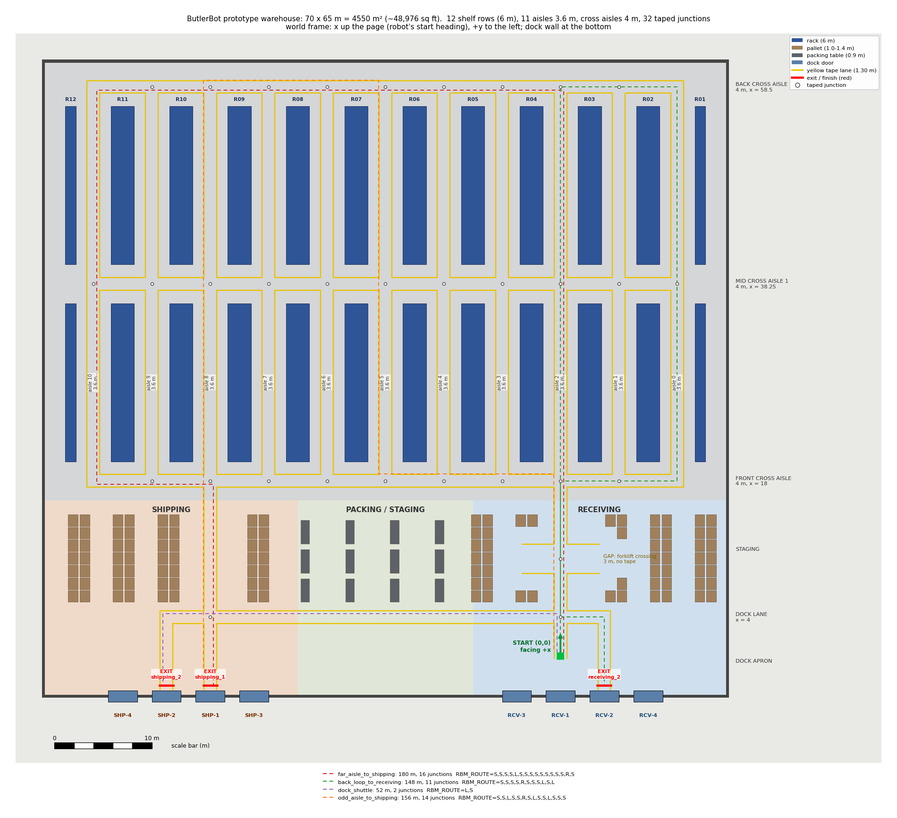

# Prototype warehouse course

**Status: starting template, not the final design.** It has no obstacles and
no new sensors yet. Next steps are listed at the end.



Everything comes from one generator, so change a number in `WarehouseSpec` and regenerate:

```bat
python scripts\warehouse_builder.py
python scripts\warehouse_builder.py --summary
```

The first command writes three files:
* `tracks/warehouse.json`: the road graph, in the same `roads` / `exit` format as `plus` / `t_end` / `gap45`.
* `webots/worlds/butlerbot_warehouse.wbt`
* the preview, `/workspace/warehouse_preview.png` by default (`--preview docs\warehouse_preview.png` for the copy in this folder).

`--summary` prints the numbers and the RBM_ROUTE strings without writing anything.

`tests/test_warehouse.py` checks that the committed files match the generator output.

## Layout (default spec)

| item | value |
|---|---|
| building | 70 m (along the dock wall, y) × 65 m (deep, x) = 4,550 m² ≈ 48,976 sq ft; walls 9 m |
| shelf rows | **12**: 10 back-to-back doubles (2 × 1.1 m + 0.2 m flue = 2.4 m) and 1 single (1.1 m) on each side wall. 22 rack faces, 6 m high, 4 beam levels, 2.7 m bays |
| aisles | 11 aisles, **3.6 m** clear between rack faces (forklift). Aisle centres y = −12, −6, 0 … 48 |
| cross aisles | 3 aisles, **4.0 m** wide: front x = 18, middle x = 38.25, back x = 58.5. Rack blocks x 20–36.25 and 40.25–56.5 |
| shipping & receiving | Dock wall at x = −4 with 8 closed 3.0 × 3.2 m roll-up doors at a 4.5 m pitch: RCV-1…4 (right, around the start) and SHP-1…4 (left, around aisle 8). Dock apron x −4…4, dock lane x = 4, staging x 4.65…16 |
| staging | Receiving and shipping zones: 108 pallets (1.2 × 1.0 m, 1.0–1.4 m high) in 2-deep staging lanes with 2.4 m forklift gaps. Packing zone: 12 packing tables (2.4 × 0.9 m, 0.9 m high) |
| tape | 1.30 m lanes with 6 cm stripes, same as every other course, **every aisle taped** (`tape_every = 1`), 731.5 m of taped centre line |

The robot starts at **(0, 0) facing +x**, the same spawn as every world.
That point is 4 m inside receiving door RCV-1, facing into the building.
The Robot block is byte-identical to `butlerbot.wbt` (a test checks this).

## Main 3D view: top-down follow cam

The world's `DEF VIEWPOINT` **follows ButlerBot from straight above**:
`follow "ButlerBot"`, `followType "Tracking Shot"`. A Tracking Shot copies the robot's
translation only, not its heading, so the map never rotates. The dock wall stays at the bottom of
the view, +x (into the building) points up and +y points left, the same as the preview.
(`"Mounted Shot"` would spin the view with the robot's heading. `"Pan and Tilt Shot"` stays in place and
tilts towards the robot, so it would no longer look straight down.)
`follow_viewpoint()` in the builder derives the pose from the spec, with nothing hard-coded:
* eye straight above the spawn (0, 0); the Tracking Shot keeps it above the robot;
* orientation `0 1 0 π/2` (ENU: identity looks along +x, so a +90° pitch about y looks straight down);
* height = `follow_span_m` (30 m) of floor across the wider side of the window at `follow_fov` 0.6 rad
  (Webots applies the FOV to the wider side of the window), and never less than
  `follow_min_clear_m` (3 m) above the tallest thing in the building (the 9 m walls; racks are 6 m, door headers stop at the wall top).
  This gives **48.5 m**: **30 m of floor across** and 20 m top to bottom in a 3:2 window
  (16.9 m at 16:9, 22.5 m at 4:3). Aisles are 6 m apart, so that is about 5 aisles across (2 either side of the robot's aisle), and the dock wall 4 m behind the start is in view.
* `near` = 1 % of the height, so the 13 mm tape doesn't z-fight the floor. `far` = 4× the height leaves room to scroll out.

The eye only moves horizontally at 48.5 m. There is no roof or ceiling, so it can't clip into
a rack, wall or door anywhere, including at the dock exits. Rack-top parallax hides
at most about 2 m of an aisle at the edge of the view; the robot's own aisle in the centre is fully visible.

The controller's camera reset (`_apply_follow_camera`) checks the world's Viewpoint. If it looks
straight down, the controller **keeps that height, orientation and FOV** (so it comes from the
builder settings), re-centres the eye on the robot, and sets `follow "ButlerBot"` / Tracking Shot.
The console prints `Camera: top-down follow (world Viewpoint) ... floor across=30.0 m`.
Every other world (`butlerbot.wbt` and the track worlds) keeps the old 3.2 m-behind chase. A world
Viewpoint with an empty `follow` is still left alone (a fixed view).

Why not the chase here: the chase eye stays 3.2 m behind the robot **in world −x**
(again, a tracking shot copies translation, not heading). At a dock exit the robot drives
−x to x = −3, so the eye (z ≈ 3.5 m) went into the door header and dock wall (x −4.3…−4).
Scroll to zoom in or out. Reloading the world restores this view.

Every rack, wall, header, door, pallet and table is a static **Solid with a
`boundingObject` Box** (no physics), with a unique name and `DEF WH_*`.
Future distance sensors, stereo depth and radar will see them. No colour in
the building passes the lane yellow test (`min(R,G) − B ≥ 0.22`); a test
checks this, so racks can't be mistaken for tape.

Shadows are off in this world: 6 m racks would put the aisles in hard shadow.
The floor uses the same appearance as the test worlds, because the lane
vision was tuned on it.

## Track: the road graph

The track is 13 roads: the start lane plus 12 more. **Every aisle (0–10) has a taped lane.**

| road | what |
|---|---|
| main (start lane) | RCV-1 → up aisle 2 → ends in a T at the back cross aisle |
| `dock_lane` | RCV-2 → x = 4 → along the dock → SHP-2. Sharp corners at both ends; exits `receiving_2` / `shipping_2` |
| `forklift_crossing` | 3.0 m wide, no tape across the start lane at x = 10. The **gap** (GAP_CROSS, ~2 m blind) |
| `perimeter` | Loop on the front / back cross aisles and the edge aisles 0 and 10. Four sharp 90° corners |
| `aisle_1`, `aisle_3`…`aisle_7`, `aisle_9` | Front cross aisle → back cross aisle (T on the perimeter at each end, plus at `cross_1`) |
| `aisle_8` | SHP-1 → through the staging area → back cross aisle (exit `shipping_1`) |
| `cross_1` | Middle cross aisle, edge aisle to edge aisle |

**32 junctions** (14 plus, 18 T), 6 m apart along the cross aisles:
* plus crossings: 4 on the start lane, 4 on aisle 8, and every other inner aisle × `cross_1`
* T's: every inner aisle starts and ends on the perimeter, and `cross_1` ends on the edge aisles

There are also **6 sharp corners**, the gap, and **3 exits** with red finish bars.

## Routes: RBM_ROUTE per junction

The robot reads no map. At every junction with two or more ways on it takes
the next `RBM_ROUTE` entry; corners don't use one. In a warehouse that means
one entry per T and crossing passed, including going straight past an aisle.

`src/route_planner.py` turns the track into a junction graph and works these
strings out. It is generic and gives the same answers as the hand-written
routes on `plus` / `t_end` / `t_left` / `t_right` / `gap45` (tested).

| mission | path | length | junctions | RBM_ROUTE |
|---|---|---|---|---|
| `far_aisle_to_shipping` | RCV-1 → up aisle 2 → back cross aisle → down far aisle 10 → front → SHP-1 | 180 m | 16 (+2 corners) | `S,S,S,S,L,S,S,S,S,S,S,S,S,S,R,S` |
| `back_loop_to_receiving` | RCV-1 → up aisle 2 → back → aisle 0 → front → back through the gap → RCV-2 | 148.5 m | 11 (+3 corners) | `S,S,S,S,R,S,S,S,L,S,L` |
| `dock_shuttle` | RCV-1 → dock lane → SHP-2 | 51.5 m | 2 (+1 corner) | `L,S` |
| `odd_aisle_to_shipping` | RCV-1 → front cross aisle → **down aisle 5** (front → back) → back cross aisle → down aisle 8 → SHP-1 | 156 m | 14 | `S,S,L,S,S,R,S,L,S,S,L,S,S,S` |

**With no `RBM_ROUTE` the robot never stops.** The default (straight, else
left) circles the perimeter and never reaches an exit; the planner reports
this, and `routes.default` is `null`.

## Offline sim

```bat
python scripts\intersection_matrix.py --only warehouse
python scripts\rowfit_sim.py warehouse --route L,S --max-s 300 --table
```

`--max-s` is needed because the default limit of 90 s is too short for the
warehouse.

## Next steps (placeholders in place)

1. **Stereo depth cameras** on the robot. Shelves, pallets, tables and walls are already Solids with boundingObjects; check the depth against the generator's boxes (`Layout.racks()` / `staging()`).
2. **Radar.**
3. **Obstacles.** The empty `DEF WH_OBSTACLES Group` in the world is the place for them, filled by the generator.
4. Design: a second middle cross aisle (`n_mid_cross`), and realistic dock levelers / door states.
